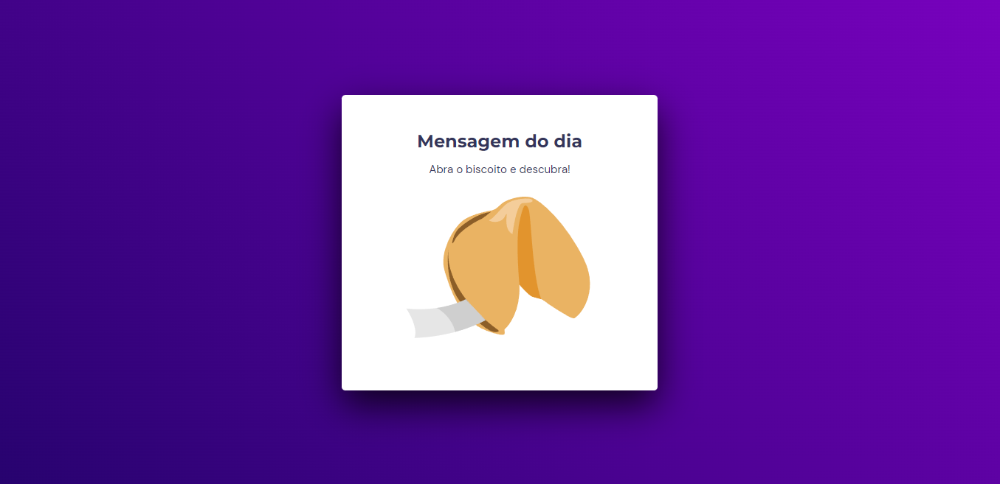

<h1 align="center"> Fortune Cookie </h1>

> [Technologies](#technologies)

> [Project](#project)

> [License](#license)

> [README in Portuguese](#readme-in-portuguese)

  

 

  

## Technologies

This project was developed with the following technologies:

- HTML
- CSS
- JavaScript
- Git e Github
- Figma

## Project

Developed a fortune cookie page, in which the user, with a click or enter, opens a cookie with the message of the day.

- To access the finished project, [click here](https://fernandoalvesrufino.github.io/fortune-cookie/).

 
## License

This project is licensed under the MIT.

---

by Fernando Rufino

`Project created by Rocketseat`

 
 
 

# README in portuguese
 
 

<h1 align="center"> Biscoito da Sorte </h1>

> [Tecnologias](#tecnologias)

> [Projeto](#projeto)

> [Licença](#licença)

  

 

  

## Tecnologias

Esse projeto foi desenvolvido com as seguintes tecnologias:

- HTML
- CSS
- JacaScript
- Git e Github
- Figma

## Projeto

Desenvolvido uma pagina de Biscoito da Sorte, no qual o usuário, a partir de um clique ou enter, abre um biscoito com a mensagem do dia.

- Para acessar ao projeto finalizado, [clique aqui](https://fernandoalvesrufino.github.io/fortune-cookie/).

 
## Licença

Esse projeto está sob a licença MIT.

---

by Fernando Rufino

> Projeto criado pela Rocketseat 